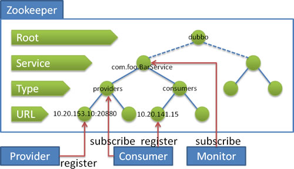

# 1. Zookeeper 注册中心安装
http://dubbo.apache.org/zh-cn/docs/admin/install/zookeeper.html

建议使用 dubbo-2.3.3 以上版本的 zookeeper [1] 注册中心客户端。
Dubbo 未对 Zookeeper 服务器端做任何侵入修改，只需安装原生的 Zookeeper 服务器即可，所有注册中心逻辑适配都在调用 Zookeeper 客户端时完成。

```sh
### 1. 安装:
wget http://archive.apache.org/dist/zookeeper/zookeeper-3.3.3/zookeeper-3.3.3.tar.gz
tar zxvf zookeeper-3.3.3.tar.gz
cd zookeeper-3.3.3
cp conf/zoo_sample.cfg conf/zoo.cfg

### 2. 配置:
vi conf/zoo.cfg
# 如果不需要集群，zoo.cfg 的内容如下 [2]：
tickTime=2000
initLimit=10
syncLimit=5
dataDir=/home/dubbo/zookeeper-3.3.3/data
clientPort=2181
# 如果需要集群，zoo.cfg 的内容如下 [3]：
tickTime=2000
initLimit=10
syncLimit=5
dataDir=/home/dubbo/zookeeper-3.3.3/data
clientPort=2181
server.1=10.20.153.10:2555:3555
server.2=10.20.153.11:2555:3555
# 并在 data 目录 [4] 下放置 myid 文件：
mkdir data
vi myid
# myid 指明自己的 id，对应上面 zoo.cfg 中 server. 后的数字，第一台的内容为 1，第二台的内容为 2，内容如下：
1

### 3. 启动:
./bin/zkServer.sh start

### 4. 停止:
./bin/zkServer.sh stop

### 5. 查看内容
telnet 127.0.0.1 2181
dump
# 或者:
echo dump | nc 127.0.0.1 2181

### 6. dubbo连接
dubbo.registry.address=zookeeper://10.20.153.10:2181?backup=10.20.153.11:2181
# 或者:
<dubbo:registry protocol="zookeeper" address="10.20.153.10:2181,10.20.153.11:2181" />
```

Zookeeper是 Apache Hadoop 的子项目，强度相对较好，建议生产环境使用该注册中心。其中 data 目录需改成你真实输出目录。其中 data 目录和 server 地址需改成你真实部署机器的信息。上面 zoo.cfg 中的 dataDir。


# 2. zookeeper 注册中心
Zookeeper 是 Apacahe Hadoop 的子项目，是一个树型的目录服务，支持变更推送，适合作为 Dubbo 服务的注册中心，工业强度较高，可用于生产环境，并推荐使用 [1]。



1. 流程说明：
    1. 服务提供者启动时: 向 /dubbo/com.foo.BarService/providers 目录下写入自己的 URL 地址
    2. 服务消费者启动时: 订阅 /dubbo/com.foo.BarService/providers 目录下的提供者 URL 地址。并向 /dubbo/com.foo.BarService/consumers 目录下写入自己的 URL 地址
    3. 监控中心启动时: 订阅 /dubbo/com.foo.BarService 目录下的所有提供者和消费者 URL 地址。
2. 支持以下功能：
    1. 当提供者出现断电等异常停机时，注册中心能自动删除提供者信息
    2. 当注册中心重启时，能自动恢复注册数据，以及订阅请求
    3. 当会话过期时，能自动恢复注册数据，以及订阅请求
    4. 当设置 `<dubbo:registry check="false" />` 时，记录失败注册和订阅请求，后台定时重试
    5. 可通过 `<dubbo:registry username="admin" password="1234" />` 设置 zookeeper 登录信息
    6. 可通过 `<dubbo:registry group="dubbo" />` 设置 zookeeper 的根节点，不设置将使用无根树
    7. 支持 * 号通配符 `<dubbo:reference group="*" version="*" />`，可订阅服务的所有分组和所有版本的提供者

# 3. 使用

Dubbo 支持 zkclient 和 curator 两种 Zookeeper 客户端实现：

在 provider 和 consumer 中增加 zookeeper 客户端 jar 包依赖：

```xml
<dependency>
    <groupId>org.apache.zookeeper</groupId>
    <artifactId>zookeeper</artifactId>
    <version>3.3.3</version>
</dependency>
```

## 3.1 使用 zkclient 客户端

从 2.2.0 版本开始缺省为 zkclient 实现，以提升 zookeeper 客户端的健状性。zkclient 是 Datameer 开源的一个 Zookeeper 客户端实现。

缺省配置：
```xml
<dubbo:registry ... client="zkclient" />
<!-- 或： -->
dubbo.registry.client=zkclient
<!-- 或： -->
zookeeper://10.20.153.10:2181?client=zkclient
<!-- 需依赖或直接下载： -->
<dependency>
    <groupId>com.github.sgroschupf</groupId>
    <artifactId>zkclient</artifactId>
    <version>0.1</version>
</dependency>
```

## 3.2 使用 curator 客户端

从 2.3.0 版本开始支持可选 curator 实现。Curator 是 Netflix 开源的一个 Zookeeper 客户端实现。

如果需要改为 curator 实现，请配置：
```xml
<dubbo:registry ... client="curator" />
<!-- 或： -->
dubbo.registry.client=curator
<!-- 或： -->
zookeeper://10.20.153.10:2181?client=curator
<!-- 需依赖或直接下载： -->
<dependency>
    <groupId>com.netflix.curator</groupId>
    <artifactId>curator-framework</artifactId>
    <version>1.1.10</version>
</dependency>
<!-- https://mvnrepository.com/artifact/org.apache.curator/curator-x-discovery -->
<dependency>
    <groupId>org.apache.curator</groupId>
    <artifactId>curator-x-discovery</artifactId>
    <version>4.0.1</version>
</dependency>
<!-- gradle -->
"org.apache.curator:curator-x-discovery:${curator_x_discovery}",
```

# 4. zookeeper 配置

## 4.1 Zookeeper 单机配置:

```xml
<dubbo:registry address="zookeeper://10.20.153.10:2181" />
<!-- 或： -->
<dubbo:registry protocol="zookeeper" address="10.20.153.10:2181" />
```

## 4.2 Zookeeper 集群配置：

```xml
<dubbo:registry address="zookeeper://10.20.153.10:2181?backup=10.20.153.11:2181,10.20.153.12:2181" />
<!-- 或： -->
<dubbo:registry protocol="zookeeper" address="10.20.153.10:2181,10.20.153.11:2181,10.20.153.12:2181" />
```

## 4.3 同一 Zookeeper，分成多组注册中心:

```xml
<dubbo:registry id="chinaRegistry" protocol="zookeeper" address="10.20.153.10:2181" group="china" />
<dubbo:registry id="intlRegistry" protocol="zookeeper" address="10.20.153.10:2181" group="intl" />
```

# 5. 可靠性声明

阿里内部并没有采用 Zookeeper 做为注册中心，而是使用自己实现的基于数据库的注册中心，即：Zookeeper 注册中心并没有在阿里内部长时间运行的可靠性保障，此 Zookeeper 桥接实现只为开源版本提供，其可靠性依赖于 Zookeeper 本身的可靠性。

# 6. 兼容性声明

因 2.0.8 最初设计的 zookeeper 存储结构不能扩充不同类型的数据，2.0.9 版本做了调整，所以不兼容，需全部改用 2.0.9 版本才行，以后的版本会保持兼容 2.0.9。2.2.0 版本改为基于 zkclient 实现，需增加 zkclient 的依赖包，2.3.0 版本增加了基于 curator 的实现，作为可选实现策略。


# 参考

1. http://dubbo.apache.org/zh-cn/docs/user/references/registry/zookeeper.html
2. https://www.bilibili.com/video/av47009143/?p=6
3. http://zookeeper.apache.org/doc/r3.3.3/zookeeperAdmin.html