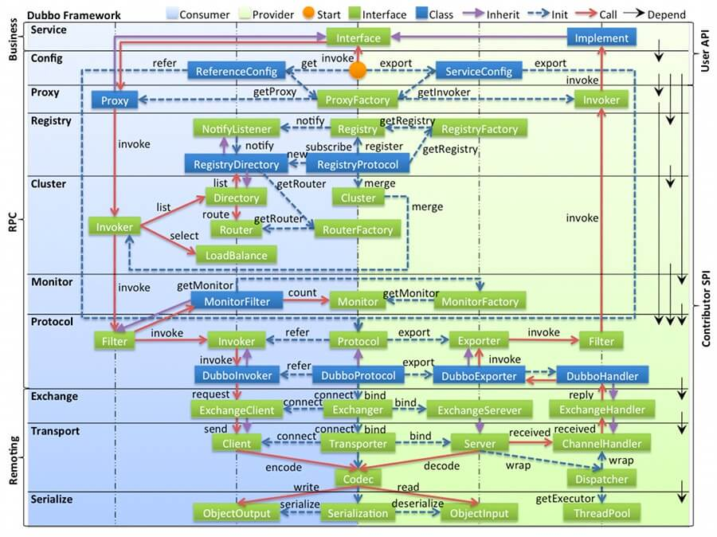

Dubbo 框架的分层设计 一共分成 10 层，当然理解后是非常清晰的。

1. 各层说明: 虽然，有 10 层这么多，但是总体是分层 Business、RPC、Remoting 三大层
    1. Business：`Business层是应用层的接口和实现类，完成应用层的业务逻辑。`
        1. Service业务层：业务代码的接口与实现。实际使用 Dubbo 的业务层。接口层，给服务提供者和消费者来实现的。
    2. RPC：`RPC层是Dubbo框架的核心，提供透明化的服务发布和服务引用，里面可以细分为如下六层`
        2. config配置层：对Dubbo进行各种配置的，以ServiceConfig, ReferenceConfig为中心，可以直接初始化配置类，也可以通过 Spring 解析配置生成配置类。
        3. proxy 服务代理层：服务接口透明代理，生成服务的客户端 Stub 和服务器端 Skeleton, 扩展接口为 ProxyFactory 。服务代理层，无论是 consumer 还是 provider，Dubbo 都会给你生成代理，代理之间进行网络通信。如果胖友了解  体系，可以类比Spring Cloud中Feign的consumer ，Spring MVC为provider 。
        4. registry 注册中心层：封装服务地址的注册与发现，以服务 URL 为中心，扩展接口为 RegistryFactory, Registry, RegistryService 。服务注册层，负责服务的注册与发现。可以类比Spring Cloud成 Eureka Client 。
        5. cluster 路由层：封装多个提供者的路由及负载均衡，并桥接注册中心，以 Invoker 为中心，扩展接口为 Cluster, Directory, Router, LoadBalance 。集群层，封装多个服务提供者的路由以及负载均衡，将多个实例组合成一个服务。类比Spring Cloud为Ribbon 。
        6. monitor 监控层：RPC 调用次数和调用时间监控，以 Statistics 为中心，扩展接口为 MonitorFactory, Monitor, MonitorService 。监控层，对 rpc 接口的调用次数和调用时间进行监控。SkyWalking 基于 MonitorFilter 实现增强，从而透明化埋点监控。
    3. Remoting：`主要实现dubbo协议，若使用hessian或其他协议，就不会用到这一层；具体细分为三层`
        7. protocol 远程调用层：封将 RPC 调用，以 Invocation, Result 为中心，扩展接口为 Protocol, Invoker, Exporter 。远程调用层，封装 rpc 调用。
        8. exchange 信息交换层：封装请求响应模式，同步转异步，以 Request, Response 为中心，扩展接口为 Exchanger, ExchangeChannel, ExchangeClient, ExchangeServer 。信息交换层，封装请求响应模式，同步转异步。
        9. transport 网络传输层：抽象 mina 和 netty 为统一接口，以 Message 为中心，扩展接口为 Channel, Transporter, Client, Server, Codec 。网络传输层，抽象 mina 和 netty 为统一接口。
        10. serialize 数据序列化层：可复用的一些工具，扩展接口为 Serialization, ObjectInput, ObjectOutput, ThreadPool 。数据序列化层。

# 参考

1. 视频 https://www.bilibili.com/video/av47009143/?p=25
2. http://dubbo.apache.org/zh-cn/docs/dev/design.html
3. [设计原则](http://dubbo.apache.org/zh-cn/docs/dev/principals/introduction.html)
    1. [魔鬼在细节](http://dubbo.apache.org/zh-cn/docs/dev/principals/code-detail.html)
    2. [一些设计上的基本常识](http://dubbo.apache.org/zh-cn/docs/dev/principals/general-knowledge.html)