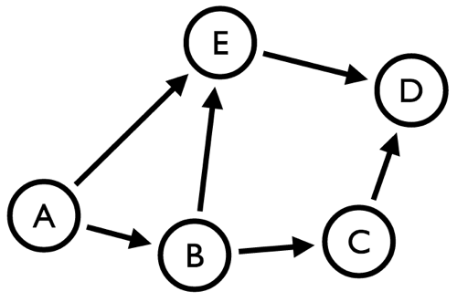

# 图处理：使用graphstream来计算无向图的介数中心性

graphstream只能处理无向图

Mark Needham

原文：[Graph Processing: Calculating betweenness centrality for an undirected graph using graphstream - Mark Needham at Mark Needham ](http://www.markhneedham.com/blog/2013/07/19/graph-processing-calculating-betweenness-centrality-for-an-undirected-graph-using-graphstream/)

阅读

1. [Maven Repository: graphstream ](http://mvnrepository.com/search?q=graphstream)
2. [graphstream/gs-algo: Graphstream algo ](https://github.com/graphstream/gs-algo)
3. [GraphStream - GraphStream - A Dynamic Graph Library ](http://graphstream-project.org/)

由于现在的大部分时间都是围绕图的数据处理，所以我觉得学习更多关于图的处理知识是很有趣的。这是我的同事Jim几年前写的一个主题。

I like to think of the types of queries you’d do with a graph processing engine as being similar in style graph global queries where you take most of the nodes in a graph into account and do some sort of calculation.
（这段从句较多，也对文章的理解没有多大的帮助，就直接贴原文了）

我最近遇到的一个有趣的全局图形算法是`介数中心性betweenness centrality`，它表明每个节点相对网络/图形的其他节点的中心位置的度量。

[`介数中心性betweenness centrality`]即最短路径中的所有顶点都通过该节点的数量。`介数中心性betweenness centrality`更加有用（相对连通性，即图中的度），度量了节点的负载和重要性。前者具全局性，而后者仅是局部效应。

# graphstream maven

我想找到一个代码库，可以更好的理解该算法。然后我找到了graphstream，来完成这项工作。

下面maven pom文件所定义的库依赖，能让代码正常运行：

```xml
<project xmlns="http://maven.apache.org/POM/4.0.0" xmlns:xsi="http://www.w3.org/2001/XMLSchema-instance" xsi:schemaLocation="http://maven.apache.org/POM/4.0.0 http://maven.apache.org/xsd/maven-4.0.0.xsd">
    <modelVersion>4.0.0</modelVersion>
    <packaging>jar</packaging>
    <artifactId>my-gs-project</artifactId>
    <groupId>org.graphstream</groupId>
    <version>1.0-SNAPSHOT</version>
    <name>my-gs-project</name>
    <description/>
    <dependencies>
        <dependency>
            <groupId>org.graphstream</groupId>
            <artifactId>gs-core</artifactId>
            <version>1.3</version>
        </dependency>
        <dependency>
            <groupId>org.graphstream</groupId>
            <artifactId>gs-algo</artifactId>
            <version>1.3</version>
        </dependency>
    </dependencies>
</project>
```

# 简单的例子

我想找一个演示的例子，可以了解介数计算。后来，我发现内华达大学的[一个14页的幻灯片](http://www.cse.unr.edu/~mgunes/cs765/cs790f09/Lecture13.ppt)。

示例图如下所示：
<!---->


`介数Betweeness`
为了计算出中间的中心性，需要对每一对节点进行处理。观察节点之间哪一个节点是必须经过的。

```
A -> B: None
A -> C: B
A -> D: B, C
A -> E: B, C, D
B -> C: None
B -> D: C
B -> E: C, D
C -> D: None
C -> E: D
D -> E: None
```

对于这个例子，最终每个节点中心值如下所示：

```
A: 0
B: 3
C: 4
D: 3
E: 0
```

如果通过graphstream运行这个值，会看到这个值加倍，因为graphstream忽略了关系的方向（例如，它可以B->A，也可以A->B）。

```java
public class Spike {
    public static void main(String[] args) {
        Graph graph = new SingleGraph("Tutorial 1");
 
        Node A = graph.addNode("A");
        Node B = graph.addNode("B");
        Node E = graph.addNode("E");
        Node C = graph.addNode("C");
        Node D = graph.addNode("D");
 
        graph.addEdge("AB", "A", "B");
        graph.addEdge("BC", "B", "C");
        graph.addEdge("CD", "C", "D");
        graph.addEdge("DE", "D", "E");
 
        BetweennessCentrality bcb = new BetweennessCentrality();
        bcb.init(graph);
        bcb.compute();
 
        System.out.println("A="+ A.getAttribute("Cb"));
        System.out.println("B="+ B.getAttribute("Cb"));
        System.out.println("C="+ C.getAttribute("Cb"));
        System.out.println("D="+ D.getAttribute("Cb"));
        System.out.println("E="+ E.getAttribute("Cb"));
    }
}
A=0.0
B=6.0
C=8.0
D=6.0
E=0.0
```
从这个例子中可以学到，节点C是这个图中最有影响力的节点，因为其他节点连通的大部分都必须经过节点C。虽然节点“B”和“D”紧跟在后面，相比节点C还是差一点。

#官方的例子

现在对算法有了基本的理解，应该试试文档中提供的例子。

示例图如下所示：

<!---->


要知道graphstream将图只处理无向图，文章中就不考虑方向的关系。节点之间的路径如下所示：

```
A -> B: Direct Path Exists
A -> C: B
A -> D: E
A -> E: Direct Path Exists
B -> A: Direct Path Exists
B -> C: Direct Path Exists
B -> D: E or C
B -> E: Direct Path Exists
C -> A: B
C -> B: Direct Path Exists
C -> D: Direct Path Exists
C -> E: D or B
D -> A: E
D -> B: C or E
D -> C: Direct Path Exists
D -> E: Direct Path Exists
E -> A: Direct Path Exists
E -> B: Direct Path Exists
E -> C: D or B
E -> D: Direct Path Exists
```

对于其中一些有两个潜在的路径，所以我们给每个节点1/2个点，获得如下的介数。

```
A: 0
B: 3
C: 1
D: 1
E: 3
```
如果我们用graphstream我们会看到相同的值:

```java
public class Spike {
    public static void main(String[] args) {
        Graph graph = new SingleGraph("Tutorial 1");
 
        Node A = graph.addNode("A");
        Node B = graph.addNode("B");
        Node E = graph.addNode("E");
        Node C = graph.addNode("C");
        Node D = graph.addNode("D");
 
        graph.addEdge("AB", "A", "B");
        graph.addEdge("BE", "B", "E");
        graph.addEdge("BC", "B", "C");
        graph.addEdge("ED", "E", "D");
        graph.addEdge("CD", "C", "D");
        graph.addEdge("AE", "A", "E");
 
        BetweennessCentrality bcb = new BetweennessCentrality();
        bcb.init(graph);
        bcb.compute();
 
        System.out.println("A="+ A.getAttribute("Cb"));
        System.out.println("B="+ B.getAttribute("Cb"));
        System.out.println("C="+ C.getAttribute("Cb"));
        System.out.println("D="+ D.getAttribute("Cb"));
        System.out.println("E="+ E.getAttribute("Cb"));
    }
}
A=0.0
B=3.0
C=1.0
D=1.0
E=3.0
```
这个库定义了介数中心性，但我想尝试一下其他代码库怎么处理有向图的。

到目前为止，其他的图形处理库，我知道[graphchi](graphchi), [JUNG](http://jung.sourceforge.net/)，[Green-Marl](https://github.com/stanford-ppl/Green-Marl)和[giraph](http://giraph.apache.org/)，但如果你知道其他的，请告诉我。

** Update ** (27th July 2013)

在写[另一篇有关介数中心](http://www.markhneedham.com/blog/2013/07/27/graph-processing-betweeness-centrality-neo4js-cypher-vs-graphstream/)才意识到计算时犯了一个错误，现在已纠正。

Be Sociable, Share!
