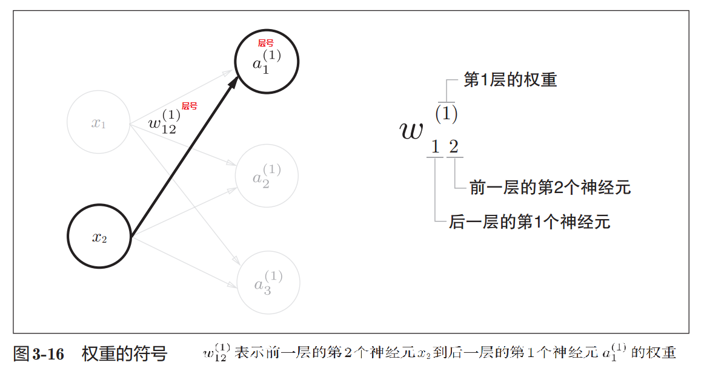
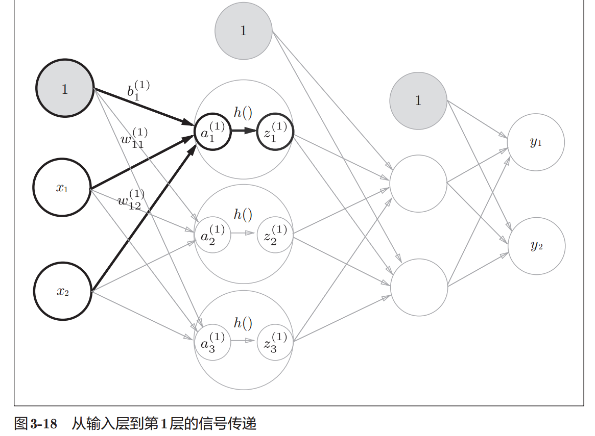
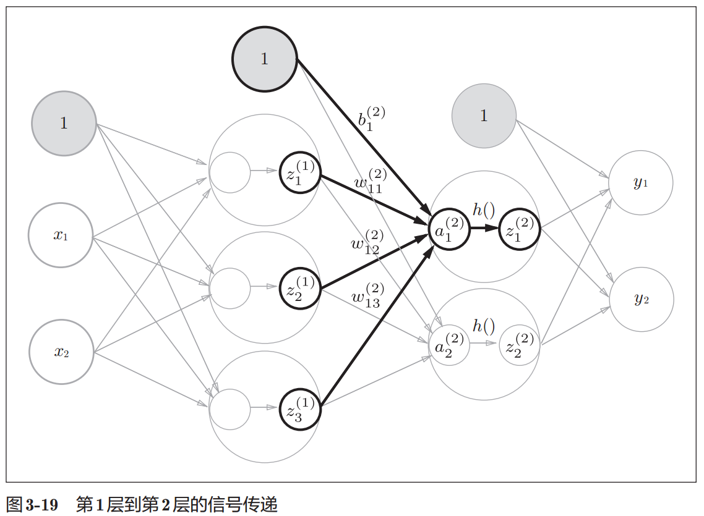

1. 神经网络的前向处理


# 1. 符号确认



# 2. 各层间信号传递的实现

1. 

```py
import numpy as np
X = np.array([1.0, 0.5])
W1 = np.array([[0.1,0.3,0.5], [0.2,0.4,0.6]])
B1 = np.array([0.1,0.2,0.3])

W1.shape    # (2,3)
X.shape     # (2,)
B1.shape    # (3,)

A1 = np.dot(X,W1) + B1
# 结果： [0.3 0.7 1.1]
```

2. 第1层中激活函数的计算过程


```py
import numpy as np
X = np.array([1.0, 0.5])
W1 = np.array([[0.1,0.3,0.5], [0.2,0.4,0.6]])
B1 = np.array([0.1,0.2,0.3])

W1.shape    # (2,3)
X.shape     # (2,)
B1.shape    # (3,)

A1 = np.dot(X,W1) + B1
# 结果： [0.3 0.7 1.1]
Z1 = sigmoid(A1)
print(A1) # [0.3, 0.7, 1.1]
print(Z1) # [0.57444252, 0.66818777, 0.75026011]
```


3. 

```py
W2 = np.array([[0.1, 0.4], [0.2, 0.5], [0.3, 0.6]])
B2 = np.array([0.1, 0.2])
print(Z1.shape) # (3,)
print(W2.shape) # (3, 2)
print(B2.shape) # (2,)
A2 = np.dot(Z1, W2) + B2
Z2 = sigmoid(A2)
```

4. 

```py
def identity_function(x):
    return x

W3 = np.array([[0.1, 0.3], [0.2, 0.4]])
B3 = np.array([0.1, 0.2])

A3 = np.dot(Z2, W3) + B3
Y = identity_function(A3) # 或者Y = A3
```


# 3. 代码实现小结

```py
# 进行权重和偏置的初始化
def init_network():
    network = {}
    network['W1'] = np.array([[0.1, 0.3, 0.5], [0.2, 0.4, 0.6]])
    network['b1'] = np.array([0.1, 0.2, 0.3])
    network['W2'] = np.array([[0.1, 0.4], [0.2, 0.5], [0.3, 0.6]])
    network['b2'] = np.array([0.1, 0.2])
    network['W3'] = np.array([[0.1, 0.3], [0.2, 0.4]])
    network['b3'] = np.array([0.1, 0.2])
    return network

# 表示从输入到输出方向的传递处理
def forward(network, x):
    W1, W2, W3 = network['W1'], network['W2'], network['W3']
    b1, b2, b3 = network['b1'], network['b2'], network['b3']
    a1 = np.dot(x, W1) + b1
    z1 = sigmoid(a1)
    a2 = np.dot(z1, W2) + b2
    z2 = sigmoid(a2)
    a3 = np.dot(z2, W3) + b3
    y = identity_function(a3)
    return y

network = init_network()
x = np.array([1.0, 0.5])
y = forward(network, x)
print(y) # [ 0.31682708 0.69627909]
```

# 参考

1. 深度学习入门.基于Python的理论与实现.斋藤康毅.2018 -> 3.4三层神经网络的实现