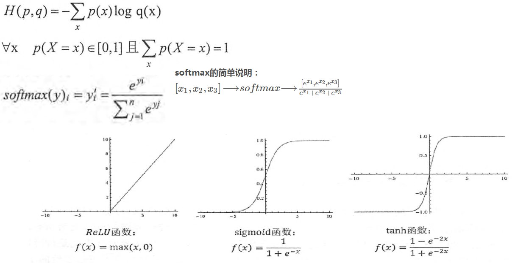

## 1. 分类问题和回归问题是监督学习的两大种类

1. 分类问题
    1. 分类问题希望解决的是将不同的样本分到事先定义好的类别中
    2. 第3章中判断一个零件是否合格的问题是 2 分类问题
    3. 4.3节中手写体数字识别问题是 10 分类问题
2. 回归问题
    1. 回归问题解决的是对具体数值的预测
    2. 需要预测的不是一个事先定义好的类别，而是一个任意实数
    3. 一般只有一个输出节点
3. 交叉熵 cross entropy
    1. 交叉熵刻画的是两个概率分布之间的距离，它是分类问题中使用比较广的一种损失函数，`交叉熵值越小，两个概率分布越接近`
    2. 交叉熵是一个信息论中的概念，原本是用来估算平均编码长度的
    3. 给定两个概率分布p和q，通过q来表示p的交叉熵为：H(p,q) = -∑p(x)log q(x)
4. 损失函数
    1. 损失函数（Loss function）是用来估量模型的预测值 f(x) 与真实值 Y 的不一致程度
    2. 它是一个非负实值函数，通常用 L(Y,f(x)) 来表示。用来衡量模型模型预测的好坏，损失函数越小，模型的鲁棒性就越好。
    3. 神经网络模型的效果以及优化的目标是通过损失函数 loss function 来定义

## 2. Softmax



### 2.1. softmax

1. Softmax回归将神经网络前向传播得到的结果变成概率分布
2. 原始神经网络的输出被用作置信度来生成新的输出
3. 交叉熵函数不是对称的：H(p,q)≠H(q,p)，刻画的是通过概率分布q来表达概率分布p的困难程度

### 2.2. tf.nn.softmax()：softmax计算
```py
# -*- coding: utf-8 -*-
import tensorflow as tf
A = [1.0,2.0,3.0,4.0,5.0,6.0]
with tf.Session() as sess:
    print (sess.run(tf.nn.softmax(A)))
# [ 0.00426978  0.01160646  0.03154963  0.08576079  0.23312201  0.63369131]
# 其中所有输出的和为1.
### 等价于以下numpy实现
import numpy as np
aa = np.array([0.1,0.2,0.3])
c = np.exp(aa) / np.sum(np.exp(aa), 0)
print(c)
# [ 0.30060961  0.33222499  0.3671654 ]
```
### 2.3. 多类别softmax with交叉熵

1. tf.nn.softmax_cross_entropy_with_logits && softmax_cross_entropy_with_logits_v2
2. tensorflow将交叉熵和softmax回归统一封装
3. cross_entropy = tf.nn.softmax_cross_entropy_with_logits(y, y_)
    1. y_代表标准答案，y代表输出结果
4. softmax_cross_entropy_with_logits_v2: softmax + 多类别cross-entropy 

```py
a  = tf.constant([[0.1, 0.2, 0.3]],dtype=tf.float32)
label = tf.constant([[0, 0, 1]],dtype=tf.float32)
b = tf.nn.softmax_cross_entropy_with_logits_v2(logits=a, labels=label)

with tf.Session() as sess:
    print(sess.run(b)) # [ 1.00194287]
    print(sess.run(tf.reduce_sum(b))) # 1.00194
### 等价于以下numpy实现: softmax(predictions) + cross_entropy
import numpy as np
def softmax(logits):
    return np.exp(logits)/np.sum(np.exp(logits))

def cross_entropy(label, prediction_softmax):
    result = np.sum(-1*np.log(prediction_softmax)*label)
    return result

prediction = np.array([[0.1, 0.2, 0.3]], dtype=np.float32)
label = np.array([[0, 0, 1]],dtype=np.float32)
c = cross_entropy(label, softmax(prediction))
print(c) # 1.00194
```

## 3. TensorFlow 实现交叉熵 cross_entropy


1. 三分类问题
    1. 正确答案(1,0,0)，预测答案(0.5,0.4,0.1)
        1. 交叉熵：H((1,0,0),(0.5,0.4,0.1))=-(1*log0.5 + 0*log0.4 + 0*log0.1)≈0.3
    2. 正确答案(1,0,0)，预测答案(0.8,0.1,0.1)
        1. 交叉熵：H((1,0,0),(0.8,0.1,0.1))=-(1*log0.8 + 0*log0.1 + 0*log0.1)≈0.1
    3. 第二个预测要优于第一个，`第二个交叉熵的值更小`
2. cross_entropy = -tf.reduce_mean(y_ * tf.log(tf.clip_by_value(y, 1e-10, 1.0)))
    1. y_代表正确结果，y代表预测结果
    2. 第1个操作：tf.clip_by_value 函数保证在进行log运算时，不会出现log0错误或者大于1的概率
    3. 第2个操作：tf.log函数对张量中所有元素依次求对数的功能
    4. 第3个操作：*不是矩阵乘法，而是元素之间直接相乘
    5. 通过上面3个运算，完成交叉熵`p(x)logq(x)`的计算
    6. 结果是n*m的二维矩阵，n为一个batch中样例的数量，m为分类的类别数量

### 4.1 tf.clip_by_value的用法

1. tf.clip_by_value(A, min, max)：输入一个张量A，把A中的每一个元素的值都压缩在min和max之间。小于min的让它等于min，大于max的元素的值等于max。

```py
import tensorflow as tf;  
import numpy as np;  
  
A = np.array([[1,1,2,4], [3,4,8,5]])  
  
with tf.Session() as sess:  
    print sess.run(tf.clip_by_value(A, 2, 5))

# [[2 2 2 4]
#  [3 4 5 5]]
```

### 4.2 tf.reduce_mean函数的作用是求平均值

1. https://blog.csdn.net/dcrmg/article/details/79797826

```py
import tensorflow as tf
 
x = [[1,2,3],
     [1,2,3]]
 
xx = tf.cast(x,tf.float32)

# axis： 指定的轴，如果不指定，则计算所有元素的均值;
mean_all = tf.reduce_mean(xx, keep_dims=False)
mean_0 = tf.reduce_mean(xx, axis=0, keep_dims=False)
mean_1 = tf.reduce_mean(xx, axis=1, keep_dims=False)
 
with tf.Session() as sess:
    m_a,m_0,m_1 = sess.run([mean_all, mean_0, mean_1])
 
print m_a    # output: 2.0
print m_0    # output: [ 1.  2.  3.]
print m_1    # output:  [ 2.  2.]
# 如果设置保持原来的张量的维度，keep_dims=True ，结果：
print m_a    # output: [[ 2.]]
print m_0    # output: [[ 1.  2.  3.]]
print m_1    #output:  [[ 2.], [ 2.]]
```


## 5. 回归问题

* 损失函数
    1. 均方误差MSE, mean squared error
    2. mse = tf.reduce_mean(tf.square(y_ - y))

## 参考

1. [softmax](https://blog.csdn.net/caomin1hao/article/details/80587327)
2. [关于机器学习中的损失函数。到底什么是损失函数](https://blog.csdn.net/qq_24753293/article/details/78788844)
3. [机器学习中的损失函数](https://blog.csdn.net/u010976453/article/details/78488279)