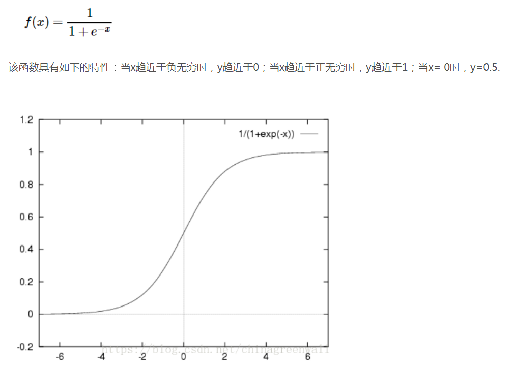

### 1. 长短时记忆网络 long short term memory

1. 长短时记忆网络
    1. 长期依赖 long-term dependencies
    2. 有用信息的间隔有大有小、长短不一，循环神经网络的性能会受到限制
    3. 与单一 tanh 循环体结构不同，LSTM是一种拥有三个“门”结构的特殊网络结构
2. 门结构
    1. 使用 sigmoid 神经网络和一个按位做乘法的操作。包括“遗忘门”，“输出门”，“输入门”
    2. 使用 sigmoid 作为激活函数的全连接神经网络层会输出一个 0 到 1 之间的数值，描述当前输入有多少信息量可以通过这个结构
    3. 0表示“不让任何成分通过”，而1表示“让所有成分通过！”
3. 在h的基础上增加一个c
    1. h 短时记忆
    2. c 长时记忆


### 2. sigmoid函数



1. 特性：
    1. 当x趋近于负无穷时，y趋近于0；
    2. 当x趋近于正无穷时，y趋近于1；
    3. 当x=0时，y=0.5.
2. 优点：
    1. Sigmoid函数的输出映射在(0,1)之间，单调连续，输出范围有限，优化稳定，可以用作输出层。
    2. 求导容易。

### 3. 遗忘门、输入门和输出门

1. 遗忘门和输入门
    1. `遗忘门`的作用是让循环神经网络“忘记”之前没有用的信息
    2. 忘记部分之前的状态，通过`输入门`补充最新的记忆
2. 输出门
    1. `输出门`根据最新的状态、上一时刻的输出和当前的输入来决定该时刻的输出

### 4. tensorflow中的实现 BasicLSTMCell

```py
#定义一个LSTM结构。LSTM中使用的变量也会在该函数中自动声明
lstm = rnn_cell.BasicLSTMCell(lstm_hidden_size)
#将LSTM中的状态初始化为全为0数组，batch_size给出一个batch的大小
state = lstm.zero_state(batch_size, tf.float32)

#定义损失函数
loss=0.0
for i in range(num_steps):
    if i > 0: tf.get_variable_scope().reuse_variables()
    #将当前输入 current_input 和前一时刻状态 state 传入定义的LSTM结构可以得到当前LSTM结构的输出 lstm_output 和更新后的状态 state
    lstm_output, state = lstm(current_input, state)
    #将当前时刻LSTM结构的输出传入一个全连接层得到最后的输出
    final_output = fully_connected(lstm_output)
    #计算当前时刻输出的损失
    loss += calc_loss(final_output, expected_output)
```

## 参考

1. [RNN, LSTM 理解](https://www.jianshu.com/p/75eeaee7f67d)
2. [Sigmoid 函数(logistic函数)笔记](https://blog.csdn.net/chinagreenwall/article/details/81113539)