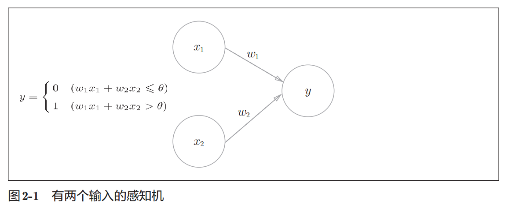

1. 感知机(Perception)
    1. 感知机(Perception)是神经网络(深度学习)的起源的算法
    2. 感知机接收多个输入信号，输出一个信号
    3. 感知机的信号只有“流/不流”(1/0)两种取值
        1. 0，不传递信号
        2. 1，传递信号

2. 
    1. $x_1、x_2 是输入信号，y 是输出信号，w_1、w_2 是权重$
    2. 图中的 ○ 称为`神经元`或者`节点`
    3. `神经元激活`：神经元计算传送过来的信号的总和，这个总和超过了`阈值` $\theta$ ，输出1
    4. 感知机的多个输入信号都有各自固有的权重。权重越大，对应该权重的信号的重要性就越高

# 参考

1. [Markdown中Latex 数学公式基本语法](https://blog.csdn.net/u014630987/article/details/70156489)
2. 深度学习入门.基于Python的理论与实现.斋藤康毅.2018 -> 2.1感知机是什么