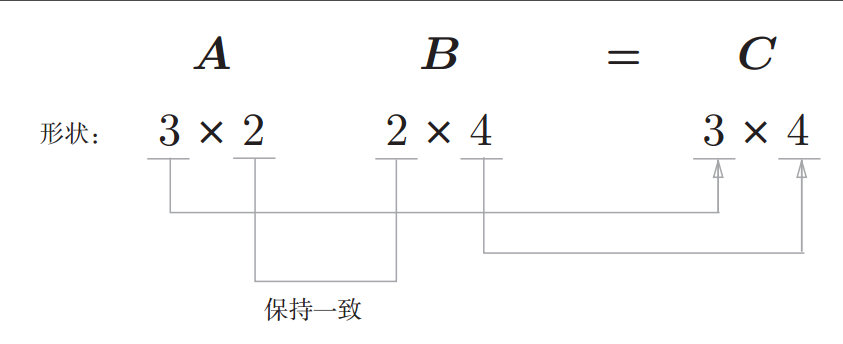

1. 解决神经网络问题的步骤分成学习和推理两个阶段：
    1. 首先使用训练数据进行权重参数的学习
    2. 进行推理时，使用刚才学习到的参数，对输入数据进行分类

# 1. MNIST数据集

1. MNIST手写数字图像集
    1. 由0到9的数字图像构成
    2. 训练图像6万张，测试图像1万张
    3. 28像素 * 28像素的灰度图像(1通道)

```py
# coding: utf-8
import sys, os
sys.path.append(os.pardir) # 为了导入父目录中的文件而进行的设定
from dataset.mnist import load_mnist
# 第一次调用会花费几分钟 ……
(x_train, t_train), (x_test, t_test) = load_mnist(flatten=True,
normalize=False)
# 输出各个数据的形状
print(x_train.shape) # (60000, 784)
print(t_train.shape) # (60000,)
print(x_test.shape) # (10000, 784)
print(t_test.shape) # (10000,)
```

2. load_mnist(normalize=True, flatten=True, one_hot_label=False)
    1. 以`(训练数据，训练标签)，（测试图像，测试标签）`的形式返回读入的MNIST的数据
    2. normalize表示是否将输入图像正规化为0.0~1.0的值
    2. flatten表示是否展开输入图像

3. PIL、Pillow安装使用方法
    1. PIL（Python Imaging Library）是Python常用的图像处理库，而Pillow是PIL的一个友好Fork，提供了了广泛的文件格式支持，强大的图像处理能力，主要包括图像储存、图像显示、格式转换以及基本的图像处理操作等。
    2. Pillow的文档：http://pillow.readthedocs.io/en/latest/
    3. Pillow的github：https://github.com/python-pillow/Pillow
    4. pip install Pillow

# 2. 神经网络的推理处理

# 3. 批处理




# 参考

1. https://github.com/oreilly-japan/deep-learning-from-scratch
    1. https://github.com/oreilly-japan/deep-learning-from-scratch/blob/master/ch03/mnist_show.py
2. 深度学习入门.基于Python的理论与实现.斋藤康毅.2018 
    1. 3.6手写数字识别
    2. 3.2激活函数 -> 阶跃函数
3. [PIL、Pillow安装使用方法](https://www.cnblogs.com/pcat/p/6790058.html)