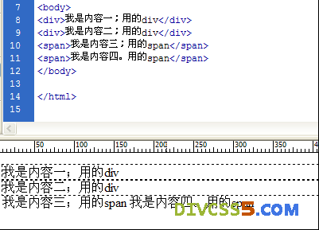
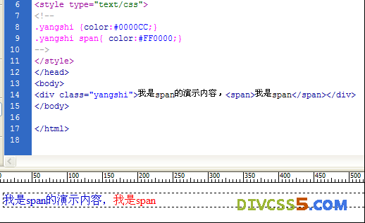

* [div与span区别及用法 - DIVCSS5 ](http://www.divcss5.com/rumen/r79.shtml)

# div与span区别
div占用的位置是一行，
span占用的是内容有多宽就占用多宽的空间距离

从上图很容易知道“我是内容一；用的div”和“我是内容二；用的div”两个内容外部用的是
标签，他们得到样式是占用了一排空间（相当于换行一样）；而“我是内容三；用的span”和“我是内容四；用的span”则，文字内容有多宽，就占用多宽距离，使用标签和不使用一样效果。

# div内span选择器

div内的span无需命名css选择器伪类，例子如下
如果div的class为yangshi，则对内的span设置css属性则，代码如下
.yanshi span{属性及属性值}

可以得出span无需再命名伪类名，直接使用css继承属性来对span设置css样式。这里本来div内的样式为对文字设置蓝色字，但是又通过继承方式设置了span的样式为文字为红色。