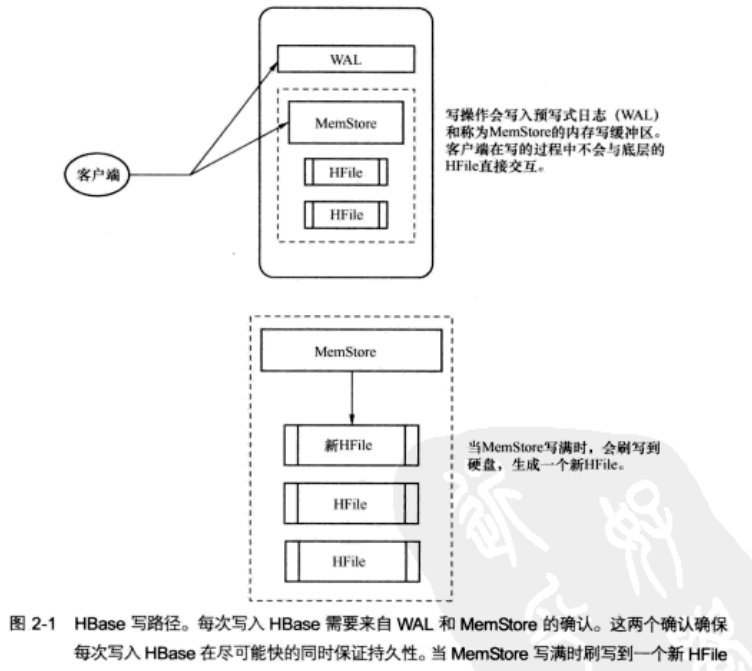

## 1. Family

```java
import org.apache.hadoop.conf.Configuration;
import org.apache.hadoop.hbase.HBaseConfiguration;
import org.apache.hadoop.hbase.HColumnDescriptor;
import org.apache.hadoop.hbase.HTableDescriptor;
import org.apache.hadoop.hbase.TableName;
import org.apache.hadoop.hbase.client.*;
import org.apache.hadoop.hbase.util.Bytes;

import java.io.IOException;

public class InsertFamilyData {
    public static void main(String[] args) throws IOException {
        Configuration config = HBaseConfiguration.create();
        config.set("hbase.zookeeper.quorum","192.168.0.243");  //hbase 服务地址
        config.set("hbase.zookeeper.property.clientPort","12181"); //端口号


        TableName tableName = TableName.valueOf("test-table");

        Connection connection = ConnectionFactory.createConnection(config);
        Admin admin = connection.getAdmin();

        HTableDescriptor descriptor = new HTableDescriptor(admin.getTableDescriptor(tableName));
        descriptor.addFamily(new HColumnDescriptor(Bytes.toBytes("info")));
        admin.disableTable(tableName);
        admin.modifyTable(tableName, descriptor);
        admin.enableTable(tableName);

        if(admin != null){
            try {
                System.out.println("start insert data ......");
                HTable table = (HTable) connection.getTable(tableName);

                Put put = new Put(Bytes.toBytes("TheRealMT"));
                put.addColumn(Bytes.toBytes("info"), Bytes.toBytes("name"), Bytes.toBytes("Mark Twain"));
                put.addColumn(Bytes.toBytes("info"), Bytes.toBytes("email"), Bytes.toBytes("samuel@clemens.org"));
                put.addColumn(Bytes.toBytes("info"), Bytes.toBytes("password"), Bytes.toBytes("Langhorne"));

                try {
                    table.put(put);
                } catch (IOException e) {
                    e.printStackTrace();
                }
                System.out.println("end insert data ......");
            }catch (IOException e) {
                e.printStackTrace();
            }
        }
    }
}

```

## 2. HBase使用坐标来定位表中的数据

```java
Put put = new Put(Bytes.toBytes("TheRealMT"));
put.addColumn(Bytes.toBytes("info"), Bytes.toBytes("name"), Bytes.toBytes("Mark Twain"));
put.addColumn(Bytes.toBytes("info"), Bytes.toBytes("email"), Bytes.toBytes("samuel@clemens.org"));
put.addColumn(Bytes.toBytes("info"), Bytes.toBytes("password"), Bytes.toBytes("Langhorne"));
```

1. 3个坐标确定了单元cell的位置[rowkey, column family, column qualifier]，例如[TheRealMT, info, name]
    1. 行键是第一个坐标，
    2. 下一个是列族，列族用做数据坐标时，表示一组列
    3. 再下一个坐标是列限定符column qualifier，或简称列column，或标志qual

## 3. 修改

1. HBase中修改数据使用的方式与存储新数据一样：创建Put对象

```java
put.addColumn(Bytes.toBytes("info"), Bytes.toBytes("password"), Bytes.toBytes("abc123"));
```

## 4. HBase写的工作机制



1. HBase新增和修改行的内部流程都是相同的
    1. 执行写入时会写到两个地方。只有当这两个地方的变化信息都写入并确认后，才认为写动作完成
        1. 预写式日志 write-ahead log，或称HLog
        2. MemStore
2. MemStore是内存里的写入缓冲区
    1. HBase中数据在永久写入硬盘之前在这里积累
    2. 当MemStore填满后，其中的数据会刷写到硬盘，生成一个HFile
    3. HFile对应于列族，一个列族可以有多个HFile，但一个HFile不能存储多个列族的数据
3. WAL
    1. 如果MemStore还没有刷写，服务器就崩溃了，内存中没有写入硬盘的数据就会丢失
    2. HBase在写动作完成之前先写入WAL
    3. HBase集群中每台服务器维护一个WAL来记录发生的变化
    4. 大多数情况下，HBase使用Hadoop分布式文件系统 HDFS 来作为底层文件系统
4. 数据恢复
    1. 如果HBase服务器宕机，没有从MemStore里刷写到HFile的数据将可以通过回放WAL来恢复，不需要手工执行
    2. 每台HBase服务器有一个WAL，服务器上所有的表和列族共享这个WAL
5. 禁用WAL
    1. Put p = new Put(); p.setWriteToWAL(false);


## 参考

1. [HBase添加Column Family](https://blog.csdn.net/ipolaris/article/details/8554039)