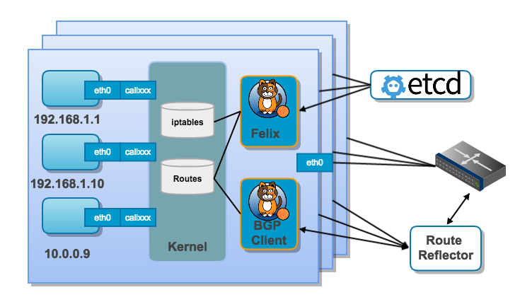

* [数人云博客 ](http://blog.shurenyun.com/)
* [最新实践 | 将Docker网络方案进行到底 ](http://blog.shurenyun.com/shurenyun-docker-133/)
* [DockOne技术分享（二）：集群规模下日志处理和网络方案 - DockOne.io ](http://dockone.io/article/355)
* [容器网络——从CNI到Calico（360搜索） - DockOne.io ](http://dockone.io/article/2578)
* [DockOne微信分享（一三八）：白话Kubernetes网络 - DockOne.io ](http://dockone.io/article/2616)

# 现有的主要Docker网络方案
首先简单介绍下现有的容器网络方案，网上也看了好多对比，大家之前都是基于实现方式来分，以下两个方案引自作者彭哲夫在DockOne的分享：

## 隧道方案
通过隧道，或者说Overlay Networking的方式：

* Weave，UDP广播，本机建立新的BR，通过PCAP互通。
* Open vSwitch（OVS），基于VxLAN和GRE协议，但是性能方面损失比较严重。
* Flannel，UDP广播，VxLan。

隧道方案在IaaS层的网络中应用也比较多，大家共识是随着节点规模的增长复杂度会提升，而且出了网络问题跟踪起来比较麻烦，大规模集群情况下这是需要考虑的一个点。

## 路由方案
还有另外一类方式是通过路由来实现，比较典型的代表有：

* Calico，基于BGP协议的路由方案，支持很细致的ACL控制，对混合云亲和度比较高。
* Macvlan，从逻辑和Kernel层来看隔离性和性能最优的方案，基于二层隔离，所以需要二层路由器支持，大多数云服务商不支持，所以混合云上比较难以实现。

路由方案一般是从3层或者2层实现隔离和跨主机容器互通的，出了问题也很容易排查。

我觉得Docker 1.9以后再讨论容器网络方案，不仅要看实现方式，而且还要看网络模型的“站队”，比如说你到底是要用Docker原生的 “CNM”，还是CoreOS，谷歌主推的“CNI”。

### Docker Libnetwork Container Network Model（CNM）阵营

* Docker Swarm overlay
* Macvlan & IP network drivers
* Calico
* Contiv（from Cisco）

Docker Libnetwork的优势就是原生，而且和Docker容器生命周期结合紧密；缺点也可以理解为是原生，被Docker“绑架”。

### Container Network Interface（CNI）阵营

* Kubernetes
* Weave
* Macvlan
* Flannel
* Calico
* Contiv
* Mesos CNI

CNI的优势是兼容其他容器技术（e.g. rkt）及上层编排系统（Kuberneres & Mesos)，而且社区活跃势头迅猛，Kubernetes加上CoreOS主推；缺点是非Docker原生。

而且从上的也可以看出，有一些第三方的网络方案是“脚踏两只船”的， 我个人认为目前这个状态下也是合情理的事儿，但是长期来看是存在风险的，或者被淘汰，或者被收购。

# Calico
接下来重点介绍Calico，原因是它在CNM和CNI两大阵营都扮演着比较重要的角色。即有着不俗的性能表现，提供了很好的隔离性，而且还有不错的ACL控制能力。

Calico是一个`纯3层的数据中心网络`方案，而且无缝集成像OpenStack这种IaaS云架构，能够提供可控的VM、容器、裸机之间的IP通信。

通过将整个互联网的可扩展IP网络原则压缩到数据中心级别，Calico在每一个计算节点利用Linux Kernel实现了一个高效的`vRouter来负责数据转发，而每个vRouter通过BGP协议负责把自己上运行的workload的路由信息向整个Calico网络内传播——小规模部署可以直接互联`，大规模下可通过指定的BGP route reflector来完成。

这样保证最终所有的workload之间的数据流量都是通过IP路由的方式完成互联的。

Calico节点组网可以直接利用数据中心的网络结构（无论是L2或者L3），不需要额外的NAT，隧道或者Overlay Network。 

如上图所示，这样保证这个方案的简单可控，而且没有封包解包，节约CPU计算资源的同时，提高了整个网络的性能。

此外，`Calico基于iptables`还提供了丰富而灵活的网络Policy，保证通过各个节点上的ACLs来提供Workload的多租户隔离、安全组以及其他可达性限制等功能。

## Calico架构

结合上面这张图，我们来过一遍Calico的核心组件：

* Felix，Calico Agent，跑在每台需要运行Workload的节点上，主要负责配置路由及ACLs等信息来确保Endpoint的连通状态；
* etcd，分布式键值存储，主要负责网络元数据一致性，确保Calico网络状态的准确性；
* BGP Client（BIRD）, 主要负责把Felix写入Kernel的路由信息分发到当前Calico网络，确保Workload间的通信的有效性；
* BGP Route Reflector（BIRD），大规模部署时使用，摒弃所有节点互联的 mesh 模式，通过一个或者多个BGP Route Reflector来完成集中式的路由分发。

## Calico Docker Network 核心概念

从这里开始我们将“站队” CNM，通过Calico Docker libnetwork plugin的方式来体验和讨论Calico容器网络方案。

先来看一下CNM模型： 

从上图可以知道，CNM基于3个主要概念：

* `Sandbox，包含容器网络栈的配置`，包括Interface，路由表及DNS配置，对应的实现如：Linux Network Namespace；一个Sandbox可以包含多个Network；
* `Endpoint`，做为Sandbox接入Network的介质，对应的实现如：veth pair、TAP；一个Endpoint只能属于一个Network，也只能属于一个Sandbox；
* `Network`，一组可以相互通信的Endpoints；对应的实现如：Linux bridge、VLAN；Network有大量Endpoint资源组成。

除此之外，CNM还需要依赖另外两个关键的对象来完成Docker的网络管理功能，他们分别是：

* NetworkController，对外提供分配及管理网络的APIs，Docker Libnetwork支持多个活动的网络driver，NetworkController允许绑定特定的driver到指定的网络；
* Driver，网络驱动对用户而言是不直接交互的，它通过插件式的接入来提供最终网络功能的实现；Driver（包括IPAM）负责一个Network的管理，包括资源分配和回收。

有了这些关键的概念和对象，配合Docker的生命周期，通过APIs就能完成管理容器网络的功能，具体的步骤和实现细节这里不展开讨论了， 有兴趣的可以移步 Github：

https://github.com/docker/libnetwork/blob/master/docs/design.md

接下来再介绍两个Calico的概念：

* Pool，定义可用于Docker Network的IP资源范围，比如：10.0.0.0/8或者192.168.0.0/16；
* Profile，定义Docker Network Policy的集合，由tags和rules组成；每个 Profile默认拥有一个和Profile名字相同的Tag，每个Profile可以有多个Tag，以List形式保存。 Profile样例：

