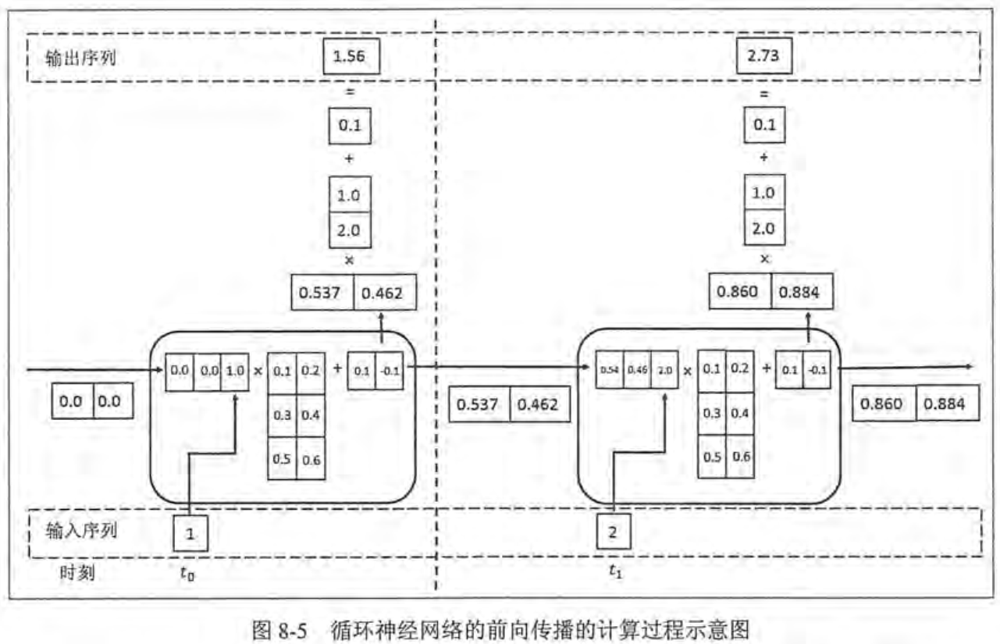

## 1. 霍普菲尔德网络

* 循环神经网络(recurrent neural network, RNN)源自于霍普菲尔德网络。
* 循环神经网络挖掘数据中的时序信息以及语义信息的深度表达能力被充分利用，并在语音识别、语言模型、机器翻译以及时序分析等方面实现了突破。

## 2. 循环神经网络的主要用途是处理和预测序列数据

* 循环神经网络会记忆之前的信息，并利用之前的信息影响后面结点的输出。
* 循环神经网络的隐含层之间的结点是有连接的，隐含层的输入不仅包括输入层的输出，还包括上一时刻隐含层的输出

## 3. 循环神经网络会对于每一个时刻的输入结合当前模型的状态给出一个输出

* 循环神经网络在每一个时刻会有一个输入Xt，然后根据循环神经网络当前的状态At提供一个输出Ht，而循环神经网络当前的状态At是根据上一时刻状态At-1和当前的输入Xt共同决定的。
* 循环神经网络要求每一个时刻都有一个输入，但是不一定每个时刻都需要有输出

## 4. RNN的结构

1. 如果一个函数的输入均值为零，输出均值也为0。就称为具有零偏特性。比如tanh(x)

## 5. 循环体

* 被复制多次的结构被称之为循环体
* 循环体网络结构中的参数在不同时刻是共享的

## 6. 一个使用最简单的循环体结构的循环神经网络

* 循环神经网络中的状态是通过一个向量来表示的
    * [矩阵、向量、行列式、特征值与特征向量](https://blog.csdn.net/a727911438/article/details/77531973)
* 向量的维度也称为循环神经网络隐含层的大小，假设为h
* 假设输入向量的维度为x，那么循环体的全连接层神经网络的输入大小为h+x
  * 将上一时刻的状态与当前时刻的输入拼接成一个大的向量作为循环体中神经网络的输入
* 因为该神经网络的输出为当前时刻的状态，于是输出层的节点个数也为h，循环体中的参数个数为(h+x)*h+h
* 循环神经网络还需要一个全连接神经网络将当前时刻的状态转化为最终的输出

## 7. 循环神经网络的前向传播的计算过程




```py
X = [1,2]
state = [0.0, 0.0]
w_cell_state = np.asarray([[0.1, 0.2], [0.3, 0.4]])
w_cell_input = np.asarray([0.5, 0.6])
b_cell = np.asarray([0.1, -0.1])
w_output = np.asarray([[1.0], [2.0]])
b_output = 0.1

print (np.dot(state, w_cell_state) + X[0] * w_cell_input)
print (np.dot(state, w_cell_state) + X[0] * w_cell_input + b_cell) 
print ("state 1:",np.tanh(np.dot(state, w_cell_state) + X[0] * w_cell_input + b_cell))
print (np.dot((np.tanh(np.dot(state, w_cell_state) + X[0] * w_cell_input + b_cell)), w_output))

for i in range(len(X)):
    before_activation = np.dot(state, w_cell_state) + X[i] * w_cell_input + b_cell
    state = np.tanh(before_activation)
    final_output = np.dot(state, w_output) + b_output
    print "before activation: ", before_activation
    print "state: ", state
    print "output: ", final_output
```


## 8. 序列过长

* 梯度消散
    1. 序列过长会导致优化时出现梯度消散的问题(the vanishing gradient problem)，
    2. 实际中一般会规定一个最大长度，当序列长度超过规定长度之后会对序列进行截断