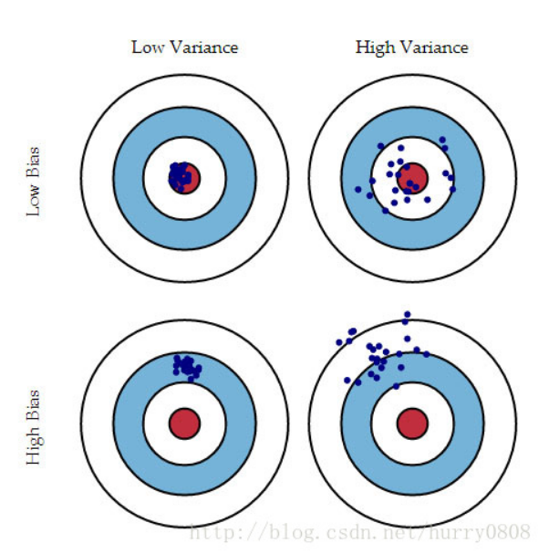

1. [over-fitting、under-fitting 与 regularization](https://www.cnblogs.com/ooon/p/5715918.html)
2. [偏差与方差，欠拟合与过拟合](https://blog.csdn.net/hurry0808/article/details/78148756)

## 1. 概念

1. 偏差(Bias)，偏差是描述了准确性
    1. 偏差指预测输出与真实标记的差别
    2. 偏差度量了学习算法的期望预测与真实结果的偏离程度，即刻画了学习算法本身的拟合能力。
2. 方差(Variance)，方差是描述稳定性
    1. 方差指一个特定训练集训练得到的函数，与所有训练集得到平均函数的差的平方再取期望
    2. 方差度量了同样大小的训练集的变动所导致的学习性能的变化，即刻画了数据扰动所造成的影响
    3. 方差表示所有模型构建的预测函数，与真实函数的差别有多大。
3. 机器学习中一个重要的话题便是模型的泛化能力，泛化能力强的模型才是好模型
    1. 对于训练好的模型，若在训练集表现差，不必说在测试集表现同样会很差，这可能是欠拟合导致；
    2. 若模型在训练集表现非常好，却在测试集上差强人意，则这便是`过拟合`导致的
    3. 过拟合与欠拟合也可以用 Bias 与 Variance 的角度来解释，欠拟合会导致高 Bias ，过拟合会导致高 Variance ，

## 2. 偏差-方差示意图

1. 
    1. 低偏差低方差时，是我们所追求的效果，此时预测值正中靶心(最接近真实值)，且比较集中(方差小)。
    2. 低偏差高方差时，预测值基本落在真实值周围，但很分散，此时方差较大，说明模型的稳定性不够好。
    3. 高偏差低方差时，预测值与真实值有较大距离，但此时值很集中，方差小；模型的稳定性较好，但预测准确率不高，处于“一如既往地预测不准”的状态。
    4. 高偏差高方差时，是我们最不想看到的结果，此时模型不仅预测不准确，而且还不稳定，每次预测的值都差别比较大。

## 3. 欠拟合-过拟合与偏差-方差关系

1. 模型欠拟合时，预测结果不准，偏差较大；
    1. 但对于不同训练集，训练得到的模型都差不多(对训练集不敏感)，此时的预测结果差别不大，方差小；
    2. 以准确率作为性能指标，模型的训练集得分及验证得分均会比较低；
    3. 模型复杂度可能低、训练集数据量可能少。
2. 模型过拟合时，模型含有训练集的信息，预测的准确度一般不高，偏差较大；
    1. 模型对训练集敏感，在与总体同分布的相同大小的不同训练样本上训练得到的模型，在验证集上的表现不一，预测结果相差大，方差大；
    2. 由于模型含有训练集的信息，此时的训练得分很高，但验证得分不高(偏差大)；模型复杂度高、训练集数量大。上述关系如下表所示：

过拟合与欠拟合

使用简单的模型去拟合复杂数据时，会导致模型很难拟合数据的真实分布，这时模型便欠拟合了，或者说有很大的 Bias，Bias 即为模型的期望输出与其真实输出之间的差异；有时为了得到比较精确的模型而过度拟合训练数据，或者模型复杂度过高时，可能连训练数据的噪音也拟合了，导致模型在训练集上效果非常好，但泛化性能却很差，这时模型便过拟合了，或者说有很大的 Variance，这时模型在不同训练集上得到的模型波动比较大，Variance 刻画了不同训练集得到的模型的输出与这些模型期望输出的差异。1模型处于过拟合还是欠拟合，可以通过画出误差趋势图来观察。若模型在训练集与测试集上误差均很大，则说明模型的 Bias 很大，此时需要想办法处理 under-fitting ；若是训练误差与测试误差之间有个很大的 Gap ，则说明模型的 Variance 很大，这时需要想办法处理 over-fitting。

353956-20160105204719403-358128731

一般在模型效果差的第一个想法是增多数据，其实增多数据并不一定会有更好的结果，因为欠拟合时增多数据往往导致效果更差，而过拟合时增多数据会导致 Gap 的减小，效果不会好太多，多以当模型效果很差时，应该检查模型是否处于欠拟合或者过拟合的状态，而不要一味的增多数据量，关于过拟合与欠拟合，这里给出几个解决方法。

解决欠拟合的方法：

增加新特征，可以考虑加入进特征组合、高次特征，来增大假设空间;
尝试非线性模型，比如核SVM 、决策树、DNN等模型;
如果有正则项可以较小正则项参数 λλ.
Boosting ,Boosting 往往会有较小的 Bias，比如 Gradient Boosting 等.
解决过拟合的方法：

交叉检验，通过交叉检验得到较优的模型参数；
特征选择，减少特征数或使用较少的特征组合，对于按区间离散化的特征，增大划分的区间。
正则化，常用的有 L1L1、L2L2 正则。而且 L1L1 正则还可以自动进行特征选择。
如果有正则项则可以考虑增大正则项参数 λλ.
增加训练数据可以有限的避免过拟合.
Bagging ,将多个弱学习器Bagging 一下效果会好很多，比如随机森林等；
交叉检验

当数据比较少是，留出一部分做交叉检验可能比较奢侈，还有只执行一次训练-测试来评估模型，会带有一些随机性，这些缺点都可以通过交叉检验克服，交叉检验对数据的划分如下：

1

交叉检验的步骤：

1）将数据分类训练集、验证集、测试集；

2）选择模型和训练参数；

3）使用训练集训练模型，在验证集中评估模型；

4）针对不同的模型，重复2）- 3）的过程；

5）选择最佳模型，使用训练集和验证集一起训练模型；

6）使用测试集来最终测评模型。

关于正则

在模型的损失函数中引入正则项，可用来防止过拟合，于是得到的优化形式如下：

w∗=argminwL(y,f(w,x))+λΩ(w)
w∗=argminwL(y,f(w,x))+λΩ(w)

这里 Ω(w)Ω(w) 即为正则项， λλ  则为正则项的参数，通常为 LpLp 的形式，即：

Ω(w)=||w||p
Ω(w)=||w||p

实际应用中比较多的是 L1L1 与 L2L2 正则，L1L1 正则是 L0L0 正则的凸近似，这里 L0L0 正则即为权重参数 ww 中值为 0 的个数，但是求解 L0L0 正则是个NP 难题，所以往往使用 L1L1 正则来近似 L0L0 , 来使得某些特征权重为 0 ，这样便得到了稀疏的的权重参数 ww。关于正则为什么可以防止过拟合，给出三种解释：

正则化的直观解释

对于规模庞大的特征集，重要的特征可能并不多，所以需要减少无关特征的影响，减少后的模型也会有更强的可解释性；L2L2 正则可以用来减小权重参数的值，当权重参数取值很大时，导致其导数或者说斜率也会很大，斜率偏大会使模型在较小的区间里产生较大的波动。加入L2L2 正则后，可使得到的模型更平滑，比如说下图所示曲线拟合，展示了加入L2L2 正则与不加 L2L2 的区别：1

正则化的几何解释

我们常见的正则，是直接加入到损失函数中的形式，其实关于 L1 与 L2 正则，都可以形式化为以下问题：

L1:minwL(y,f(w,x))    L2:minwL(y,f(w,x))    s.t.||w||22<Cs.t.||w||11<C
L1:minwL(y,f(w,x))    s.t.||w||22<CL2:minwL(y,f(w,x))    s.t.||w||11<C

至于两种形式为什么等价呢，运用一下拉格朗日乘子法就好，这里也即通常说的把 ww 限制在一个ball 里，对于 lp–balllp–ball 的形式如下图所示：  

main-qimg-6ead386ee2cd2fe0ca7f2a44aca7fc1e

对于 L1L1 与 L2L2 正则，分别对应l1–balll1–ball 与 l2–balll2–ball ，为了方便看，这里给出 l1–balll1–ball 与 l2–balll2–ball 在二维空间下的图：
l1−ball:l2−ball: |w1|+|w2|<C w21+w22<C
l1−ball: |w1|+|w2|<Cl2−ball: w12+w22<C
下图中的等高线即为模型的损失函数，上式中的两个约束条件则变成了一个半径为 CC 的 norm-ball 的形式，等高线与 norm-ball 相交的地方即为最优解：

1

可以看到，l1−balll1−ball 和每个坐标轴相交的地方都有“角”出现，而目标函数除非位置非常好，大部分时候都会在角的地方相交。注意到在角的位置即导致某个维度为 0 ，这时会导致模型参数的稀疏，这个结论可自然而然的推广到高维的情形；相比之下，l2−balll2−ball 就没有这样的性质，因为没有角，所以第一次相交的地方出现在具有稀疏性的位置的概率就变得非常小了。

正则化的贝叶斯解释

正则化的另一种解释来自贝叶斯学派，在这里可以考虑使用极大似然估计 MLE 的方式来当做损失函数，对于 MLE 中的参数 ww ，为其引入参数为 αα  的先验，然后极大化 likelihood ×× prior，便得到了 MLE 的后验估计 MAP 的形式：

MLE:MAP:L(w)=p(y|x,w)L(w)=p(y|x,w)p(w|α)
MLE:L(w)=p(y|x,w)MAP:L(w)=p(y|x,w)p(w|α)

对于 L2L2 正则，是引入了一个服从高斯分布的先验，而对于 L1L1  正则，是引入一个拉普拉斯分布的先验，两个分布分别如下：

Gussian:Laplace:p(x,μ,σ)=12π−−√σexp(−(x−μ)22σ2)p(x,μ,b)=12bexp(−|x−μ|b)
Gussian:p(x,μ,σ)=12πσexp(−(x−μ)22σ2)Laplace:p(x,μ,b)=12bexp(−|x−μ|b)

两种分布的概率密度的图形如下所示：

1

下面为参数 ww 引入一个高斯先验，即 w∼N(0,α−1I)w∼N(0,α−1I)：

p(w|α)=N(w|0,α−1I)=(α2π)n/2exp(−α2wTw)
p(w|α)=N(w|0,α−1I)=(α2π)n/2exp⁡(−α2wTw)

这里的 nn 即为参数 ww 的维度，所以得到其 MAP 形式为：
L(w⃗ )=p(y⃗ |X;w)p(w⃗ )=∏i=1mp(y(i)|x(i);w)p(w|0,a−1I)=∏i=1m12π−−√δexp(−(y(i)−wTx(i))22δ2)likelihoodα2πn/2exp(−wTw2α)prior
L(w→)=p(y→|X;w)p(w→)=∏i=1mp(y(i)|x(i);w)p(w|0,a−1I)=∏i=1m12πδexp⁡(−(y(i)−wTx(i))22δ2)⏟likelihoodα2πn/2exp⁡(−wTw2α)⏟prior

其 loglog 似然的形式为：

logL(w)⇒=mlog12π−−√δ+n2loga2π−1δ2⋅12∑i=1m(y(i)−wTx(i))2−1α⋅12wTwwMAP=argminw(1δ2⋅12∑i=1m(y(i)−wTx(i))2+1α⋅12wTw)
log⁡L(w)=mlog⁡12πδ+n2log⁡a2π−1δ2⋅12∑i=1m(y(i)−wTx(i))2−1α⋅12wTw⇒wMAP=arg⁡minw(1δ2⋅12∑i=1m(y(i)−wTx(i))2+1α⋅12wTw)

这便等价于常见的 MAP 形式：

J(w)=1N∑i(y(i)−wTx(i))2+λ||w||2
J(w)=1N∑i(y(i)−wTx(i))2+λ||w||2

同理可以得到引入拉普拉斯的先验的形式便为 L1L1 正则.具体的计算可见参考文献88。

L1 产生稀疏解的数学解释

对于样本集合 {(xi,yi)}ni=1{(xi,yi)}i=1n， 其中 xi∈Rpxi∈Rp ,换成矩阵的表示方法：

X⋅w=y
X⋅w=y

上式的含义即为求解参数 ww ,当  p>np>n 时即数据量非常少，特征非常多的情况下，会导致求解不唯一性，加上 L1L1 约束项可以得到一个确定的解，同时也导致了稀疏性的产生, L1L1 正则的形式如下：

L(w)=f(w)+λ||w||1
L(w)=f(w)+λ||w||1

这里损失函数采用了均方误差损失，即:

f(w)=||X⋅w−y||2
f(w)=||X⋅w−y||2

有唯一解的 L1L1 正则是一个凸优化问题，但是有一点，是不光滑的凸优化问题，因为在尖点处的导数是不存在的，因此需要一个 subgradient 的概念：

对于在 pp 维欧式空间中的凸开子集 UU 上定义任意的实值函数 f:U→Rf:U→R , 函数 ff  在点 w0∈Uw0∈U 处的 subgradient 满足:

f(w)–f(w0)≥g⋅(w–w0)
f(w)–f(w0)≥g⋅(w–w0)

gg 构成的集合即为再点 w0w0 处的 subgradient 集合，如下图右的蓝色线所示：

subgrad

比如说对于一维情况，f(w)=|w|f(w)=|w| ,该函数在 0 点不可导，用 subgradient 可以将其导数表示为：

f′(w)=⎧⎩⎨⎪⎪{1},     [−1,1],  {−1},   if w>0if w=0if w<0
f′(w)={{1},     if w>0[−1,1],  if w=0{−1},   if w<0

接下来对损失函数求导即可：

∇wjL(w)=ajwj−cj+λ⋅sign(wj)where:           aj=2∑i=1nx2ij           cj=2∑i=1nxij(yi−wT¬jxi¬j)
∇wjL(w)=ajwj−cj+λ⋅sign(wj)where:           aj=2∑i=1nxij2           cj=2∑i=1nxij(yi−w¬jTxi¬j)

因为 L1L1 正则的形式是根据拉格朗日乘子法得到的，拉格朗日法则需要满足 KKT 条件，即 ∇wjL(w)=0∇wjL(w)=0 ,因此另导数得 0 ，并且使用 subgradient 的概念，可以得到 wjwj 在尖点的导数取值范围：

∇wjL(w)=ajwj−cj+λ⋅sign(wj)=0
∇wjL(w)=ajwj−cj+λ⋅sign(wj)=0

利用 可得如下的形式：

ajwj−cj∈⎧⎩⎨⎪⎪{λ}, if wj<0[−λ,λ], if wj=0{−λ}, if wj>0
ajwj−cj∈{{λ}, if wj<0[−λ,λ], if wj=0{−λ}, if wj>0

分几下几种情况：

1)  若 cj<−λcj<−λ ,则 cjcj 与残差负相关，这时的 subgradient 为 0即： w^j=cj+λaj<0w^j=cj+λaj<0

2)  若 cj∈[−λ,+λ]cj∈[−λ,+λ]，此时与残差弱相关，且得到的 w^j=0w^j=0

3)  若 cj>λcj>λ, 此时 cjcj 与残差正相关， 且有w^j=cj–λaj>0w^j=cj–λaj>0 

综上可得：

w^j=⎧⎩⎨⎪⎪(cj+λ)/aj,  0       ,  (cj−λ)/aj,  if cj<−λif cj∈[−λ,λ]if cj>λ
w^j={(cj+λ)/aj,  if cj<−λ0       ,  if cj∈[−λ,λ](cj−λ)/aj,  if cj>λ

可见 cjcj 的取值正是导致稀疏性的由来，下图可以见到 cjcj 与 wjwj 的关系：

2

参考文献：

1.http://www.cnblogs.com/ooon/p/5522957.html

2.http://breezedeus.github.io/2014/11/15/breezedeus-feature-processing.html 特征组合

3.http://docs.aws.amazon.com/machine-learning/latest/dg/model-fit-underfitting-vs-overfitting.html

4.http://blog.csdn.net/vividonly/article/details/50723852

5.https://www.quora.com/What-is-the-difference-between-L1-and-L2-regularization  Quora 上的回答

6.http://freemind.pluskid.org/machine-learning/sparsity-and-some-basics-of-l1-regularization/

7.http://blog.csdn.net/zouxy09/article/details/24971995/

8.http://charlesx.top/2016/03/Regularized-Regression/ 正则化的 贝叶斯解释，另附详细的 MAP 计算

9.PRML MLAPP(P432,P433)

10.http://blog.csdn.net/myprograminglife/article/details/43015835 对 mlapp 的翻译

11.http://www.di.ens.fr/~fbach/mlss08_fbach.pdf very nice ppt