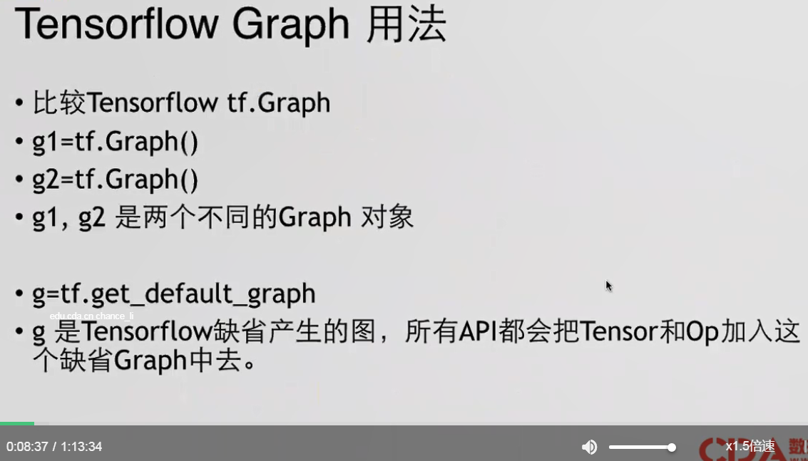
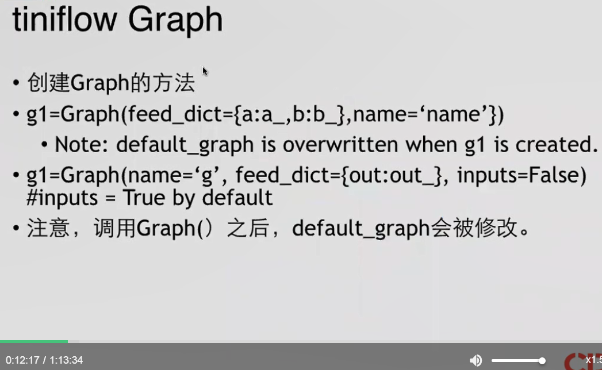

1. 
    1. 比较Tensorflow tf.Graph
        1. g1.tf.Graph()
        2. g2.tf.Graph()
        3. g1, g2是两个不同的Graph对象
    2. g=tf.get_default_graph
        1. g是Tensorflow缺省产生的图，所有API都会把Tensor和Op加入这个缺省Graph中去
2. 
    1. session=Session(graph)
    2. 如果不指定graph，Session采用缺省graph
3. 
    1. 两种方式排序
        1. 前向
        2. 后向
            1. 孤立点，对最后的结果没有贡献，去除所有用不到的节点，减少运算时间
            2. 先看E的输出的度数为0
4. 
    1. 创建Graph的方法
    2. g1 = Graph(feed_dict={a:a_, b:b_}, name='name')
        1. Note: default_graph is overwritten when g1 is created
        2. feed_dict表示输入节点或者输出节点
    3. g1 = Graph(name='g', feed_dict{out:out_}, inputs=False)
        1. inputs = True by default，feed_dict默认指的是输入节点
        2. inputs=False，feed_dict默认指的是输出节点
    4. 注意，调用Graph()之后，default_graph会被修改
    