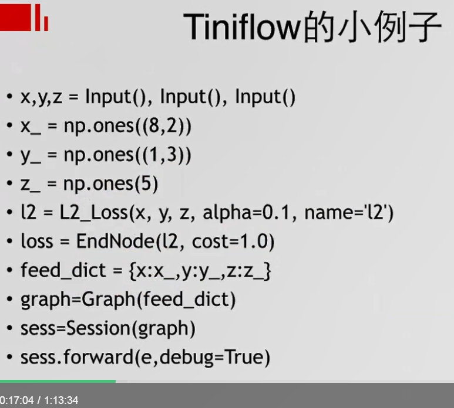
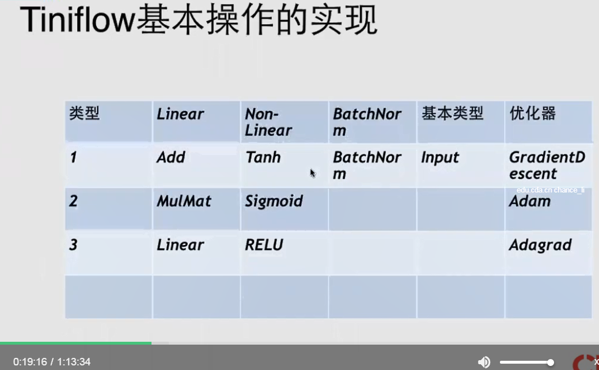
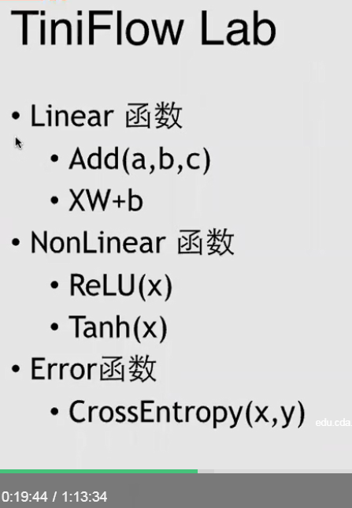
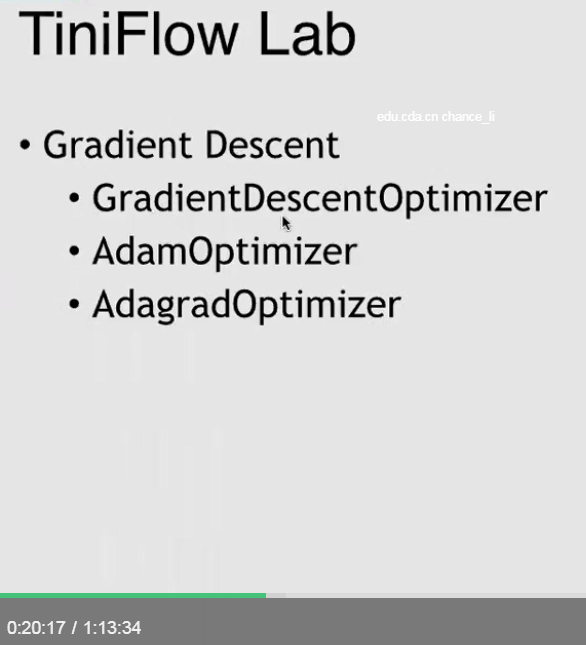
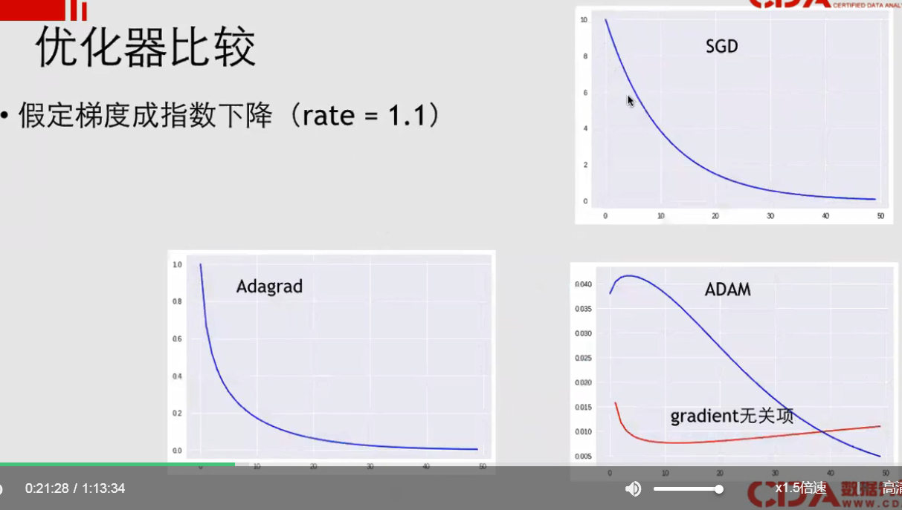
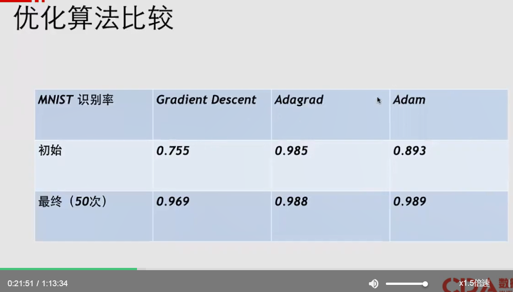

## 1. Tiniflow的结构

1. 

```py
x,y,z = Input(), Input(), Input()
x_=np.ones((8,2))
y_=np.ones((1,3))
z_=np.ones(5)
l2 = L2_Loss(x,y,z, alpha=0.1, name='l2')
loss = EndNode(l2, cost=1.0)
feed_dict = {x:x_, y:y_, z:z_}
graph = Graph(feed_dict)
sess = Session(graph)
sess.forward(e, debug=True)
```

2. Tiniflow基本操作的实现
    1. 
    2. 
    3. 
3. 细项
    1. Linear函数
        1. Add(a,b,c)
        2. XW + b
    2. NonLinear函数
        1. ReLu(x)
        2. Tanh(x)
    3. Error函数
        1. CrossEntropy(x,y)
    4. Gradient Descent
        1. GradientDecentOptimizer
        2. AdamOptimizer
        3. AdagradOptimizer
4. 
5. 
6. 


## 2. miniflow

1. https://github.com/udacity/deep-learning/ star(2922)
2. https://github.com/rndbrtrnd/udacity-deep-learning star(436)
3. https://github.com/leonardean/mini-flow/blob/master/miniflow.py
4. https://github.com/tobegit3hub/miniflow/
5. https://github.com/mKausthub/mini-flow/blob/master/miniflow.py

## 3. Python的functools.reduce用法
https://www.cnblogs.com/alan-babyblog/p/5194399.html

python 3.0以后, reduce已经不在built-in function里了, 要用它就得from functools import reduce.

reduce(function, sequence[, initial]) -> value

意思就是对sequence连续使用function, 如果不给出initial, 则第一次调用传递sequence的两个元素, 以后把前一次调用的结果和sequence的下一个元素传递给function. 如果给出initial, 则第一次传递initial和sequence的第一个元素给function.

```py
from functools import reduce 
reduce(lambda x,y: x+y, [1, 2, 3])      #输出 6 
reduce(lambda x,y: x+y, [1, 2, 3], 9)   #输出 15 
reduce(lambda x,y: x+y, [1, 2, 3], 7)   #输出 13 
```
## 4. python-map的用法 
https://www.cnblogs.com/lincappu/p/8179475.html

如果希望把list的每个元素都作平方，就可以用map()函数：
```py
def f(x):
    return x*x
print map(f, [1, 2, 3, 4, 5, 6, 7, 8, 9])
# map()函数不改变原有的 list，而是返回一个新的 list。
# 输出结果：
# [1, 4, 9, 10, 25, 36, 49, 64, 81]
```